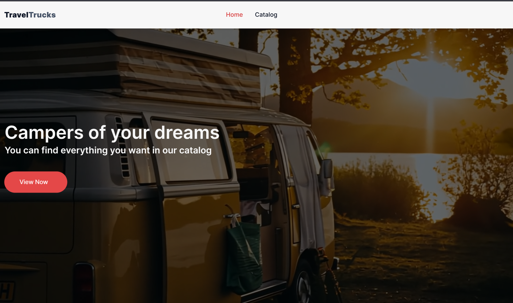
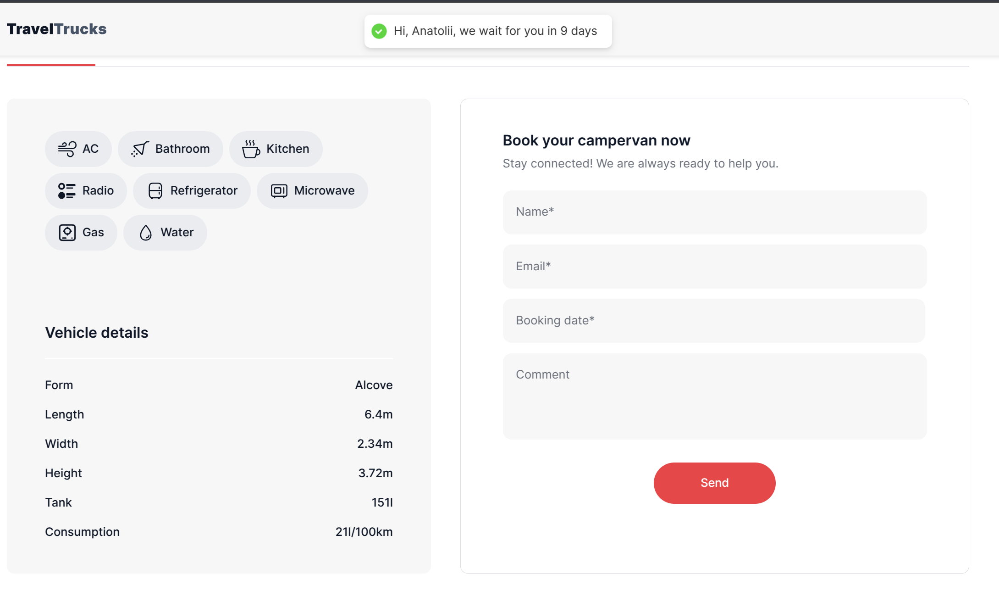

# Campers Booking Project

A website for the **TravelTruck** company to book campers for specific dates. The site displays a list of available campers, allows users to filter them, and add them to their favorites. Users can share their results with friends, as the application supports handling search parameters in the browser.

---

## Getting Started

### Run the Project in Development Mode

1. **Clone the project from GitHub:**

   ```bash
   git clone https://github.com/hrebynakha/CampersBooking.git
   ```

2. **Change the directory to the project folder:**

   ```bash
   cd CampersBooking
   ```

3. **Install React dependencies:**

   ```bash
   npm install
   ```

4. **Configure the `.env` file for backend API access:**

   ```bash
   echo "VITE_CAMPERS_API_ENDPOINT=<API_ENDPOINT_URL>" > .env
   ```

5. **Start the project:**

   ```bash
   npm run dev
   ```

6. **Open the application in your browser:**

   If everything is set up correctly, navigate to `http://localhost:5173` to see the home screen of the application.

   

---

## Usage

### Backend Configuration

Before using the application, ensure the backend is configured properly. The backend should include the following routes:

1. **Fetching the campers list:**

   - Endpoint: `/campers`

2. **Fetching camper details:**
   - Endpoint: `/campers/:id`

### Example Camper Data

Here is an example of the expected JSON format for the campers list:

```json
{
  "total": 23,
  "items": [
    {
      "id": "1",
      "name": "CamperName",
      "price": 10000,
      "rating": 4.5,
      "location": "Location",
      "description": "Description",
      "form": "form",
      "length": "7.3m",
      "width": "2.65m",
      "height": "3.65m",
      "tank": "208l",
      "consumption": "30l/100km",
      "transmission": "automatic",
      "engine": "diesel",
      "AC": true,
      "bathroom": true,
      "kitchen": false,
      "TV": true,
      "radio": true,
      "refrigerator": false,
      "microwave": true,
      "gas": false,
      "water": true,
      "gallery": [
        {
          "thumb": "path/to/static/image",
          "original": "path/to/static/image"
        }
      ],
      "reviews": [
        {
          "reviewer_name": "Name",
          "reviewer_rating": 5,
          "comment": "Great camper!"
        }
      ]
    }
  ]
}
```

---

## Form Submit Function

You can easily customize the form submission process to meet your needs.

1. Modify the `feedbackForm` function in the [feedback.js](./src/utils/feedback/feedback.js) file.

   - By default, this function does nothing.

2. Alternatively, modify the main `handleBookingSubmit` function in the [CamperDetail.jsx](./src/components/CamperDetail/CamperDetail.jsx) file.
   - By default, it displays a toast message with the booking information.

```jsx
const handleBookingSubmit = (contact) => {
  toast.success(
    `Hi, ${contact.name}, we wait for you in ${formatDistanceToNow(
      contact.bookingDate
    )}`
  );
  feedbackForm({ contact: contact, camper: camper });
  // just for user can write owns form logic
};
```

After a successful form submission, users receive a confirmation message:



---

## FAQ

### **What does the backend need?**

> The backend must have routes defined for fetching the camper list (`campers`) and camper details (`campers/:id`). Data must follow the format mentioned above.

### **How can I publish the site?**

> You can use [Vercel](https://vercel.com/) or any other available site hosting tool.

### **Do I need a license to use this?**

> No, this is a pet project. You can use, modify, and distribute it as needed.

---
